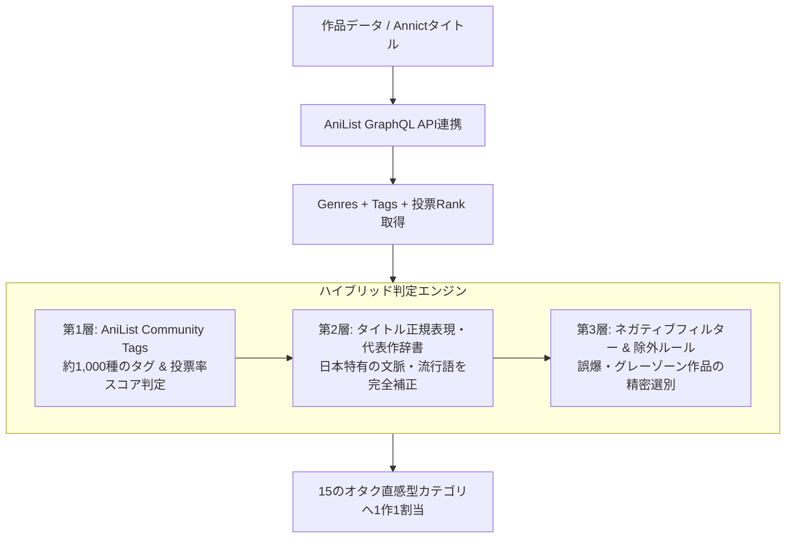

# 📚 新しいアニメジャンル分類方式 詳細解説

## 1. はじめに：なぜ新方式が必要だったのか？

Annict Watched Analyzerでは、ユーザーの視聴作品から「どんなジャンルを好んでいるか」「どの分野のオタクか」を可視化するためにジャンル分析を行っています。
データソースとして世界最大級のアニメデータベースである **AniList** のメタデータを採用していますが、従来の単純な分類方法では**「アニメファンの実際の肌感覚」と大きく乖離してしまう問題**が発生していました。

本プロジェクトで刷新された「新しいジャンル分類方式」は、海外データベースの客観的データと、日本のアニメファン（オタク文化）の直感を高精度に融合させた**ハイブリッド分類システム**です。

---

## 2. 従来方式（旧方式）の限界と3大課題

従来の方式では、AniListが公式に定義している大枠のジャンル（Action, Comedy, Fantasy, Drama など）をそのまま集計していました。しかし、これには以下の深刻な欠陥がありました。

### ① 大ジャンルへの集中（ブラックホール化問題）
* AniListの「Comedy」「Action」「Fantasy」「Slice of Life」は定義が広大すぎるため、登録作品の**70〜80%以上がこれら3〜4ジャンルに吸い込まれてしまう現象**が起きていました。
* 結果として、どのユーザーの円グラフを見ても「コメディが1位、アクションが2位」という没個性なグラフになり、好みの違いが見えなくなっていました。

### ② 近年の巨大トレンド・サブジャンルの埋没
* 近年のアニメ界で一大勢力を誇る**「異世界 / 転生」「悪役令嬢」**が単なる「Fantasy」や「Adventure」に埋もれて区別できない。
* **「日常系（きらら系など）」「アイドル・音楽もの」「ロボット / メカ」「魔法少女」**といった、アニメファンにとって極めて重要な文脈が独立して評価されない。

### ③ 国内アニメ文化と海外タグのニュアンスのズレ
* 例えば、日本のアニメファンにとっての「日常系（空気系・ほのぼの）」と海外の「Slice of Life」の認識にはズレがあり、シリアスな青春劇や仕事モノまで一括りにされていました。

---

## 3. 新方式のコア設計思想

新方式では、以下の**3つの柱**によって分類精度を劇的に向上させています。

### 柱1: 「15のオタク直感型独立カテゴリ」の策定
日本のアニメファンが普段語り合うジャンル感覚に一致するよう、従来の広大すぎる枠組みを解体・再構築し、**15個の独立カテゴリ**を定義しました。

### 柱2: 「Genres × Tags × タイトル補正」の多層判定
* **AniList公式ジャンル（Genres）**: 大枠のベース判定として活用。
* **コミュニティタグ（Tags） & 投票Rank**: AniListに数千存在する詳細タグ（`Isekai`, `Cute Girls Doing Cute Things`, `Military`, `Real Robot`, `Idol`, `Coming of Age` など）の投票スコア（Rank 50〜70以上）を解析。
* **タイトル正規表現（Regex）辞書**: 海外タグで漏れがちな邦題特有のキーワード（「悪役令嬢」「追放」「きらら」「ガルパン」「よりもい」等）を救済・オーバーライド。

### 柱3: 「1作品1カテゴリ」の排他的割り当て
* 1つの作品が複数のジャンルにまたがる場合、**「その作品の最もコアな魅力・アイデンティティは何か？」**という優先順位に基づいて、最も適切な1カテゴリを厳密に決定します。
* これにより、ユーザーごとの視聴パイチャートが「異世界系40%、日常系25%、アクション15%」のように、**アニメ視聴者としての属性（オタクタイプ）が鮮明に浮かび上がる**ようになります。

---

## 4. 15カテゴリの定義と判定優先順位

判定エンジン（`classifyAnime`）では、特徴が際立っている専門ジャンルから順に評価され、最後に汎用ジャンルへとフォールバックするパイプライン構造を採用しています。

| 優先順 | カテゴリ名 (ID) | アイコン / カラー | 主な判定要素（タグ・条件） | 代表的な該当作品例 |
| :---: | :--- | :---: | :--- | :--- |
| **1** | **魔法少女 / バトルヒロイン** `mahou_shoujo` | 🪄 `#fb7185` | `Mahou Shoujo`ジャンル、`Henshin`, `Witch`タグ、代表タイトル | まどマギ、プリキュア、なのは、シンフォギア、結城友奈 |
| **2** | **異世界 / 転生** `isekai` | 🚪 `#8b5cf6` | `Isekai`, `Reverse Isekai`, `Villainess`タグ、転生・悪役令嬢・チート等タイトル | 無職転生、リゼロ、このすば、オーバーロード、影の実力者 |
| **3** | **ロボット / メカ** `mecha` | 🤖 `#6b7280` | `Mecha`ジャンル、`Real Robot`, `Super Robot`タグ | ガンダム、エヴァ、マクロス、コードギアス、グリッドマン |
| **4** | **スポーツ / 競技** `sports` | ⚽ `#14b8a6` | `Sports`ジャンル、競技タイトル | ハイキュー!!、ブルーロック、黒子のバスケ、ウマ娘、頭文字D |
| **5** | **歴史 / 戦記 / ミリタリー** `history_military` | 🛡️ `#64748b` | `Military`, `War`, `Historical`, `Medieval`, `Tanks`タグ | ガルパン、幼女戦記、キングダム、ヴィンランド・サガ、銀河英雄伝説 |
| **6** | **アイドル / 音楽** `idol_music` | 🎵 `#eab308` | `Idol`, `Band`, `Musical Theater`タグ、`Music`単独 | アイマス、ラブライブ！、ぼっち・ざ・ろっく！、ガルクラ、ゾンサガ |
| **7** | **コメディ / ギャグ** `comedy` | 😆 `#f59e0b` | `Slapstick`, `Surreal Comedy`, `Parody`タグ（※恋愛要素なし） | 銀魂、あそびあそばせ、日常、ポプテピピック、斉木楠雄 |
| **8** | **日常 / ほのぼの** `nichijou` | ☕ `#10b981` | `Iyashikei`（癒し系）, `CGDCT`（美少女動物園）, `Camping`タグ | ゆるキャン△、ごちうさ、のんのんびより、きんモザ、メイドラゴン |
| **9** | **SF / ファンタジー** `sf_fantasy` | ☄️ `#6366f1` | `Dungeon`, `Magic`, `Cyberpunk`, `Virtual World`, `AI`タグ | シュタゲ、フリーレン、ダンジョン飯、SAO、電脳コイル、メイドインアビス |
| **10** | **ホラー / サスペンス / 推理** `horror_suspense` | 💀 `#475569` | `Horror`, `Thriller`, `Mystery`, `Psychological`ジャンル | ひぐらし、PSYCHO-PASS、約束のネバーランド、サマータイムレンダ |
| **11** | **エッチ / お色気** `ecchi` | 🔥 `#f43f5e` | `Ecchi`ジャンル ＋ `Fanservice`, `Nudity`, `Female Harem`タグ | To LOVEる、ハイスクールD×D、ヨスガノソラ、異種族レビュアーズ |
| **12** | **アクション / バトル** `action` | 💥 `#ef4444` | `Action`ジャンル ＋ `Super Power`, `Martial Arts`, `Swordplay`タグ | 鬼滅の刃、呪術廻戦、ヒロアカ、進撃の巨人、チェンソーマン |
| **13** | **恋愛 / ラブコメ** `romance` | 💖 `#ec4899` | `Romantic Comedy`, `Love Triangle`, `Yuri`, `Tsundere`タグ | かぐや様、五等分の花嫁、僕ヤバ、着せ恋、とらドラ！、俺ガイル |
| **14** | **ドラマ / 青春** `drama` | 🎭 `#0284c7` | `Coming of Age`（成長）, `Work`（お仕事）, `Tragedy`タグ | よりもい、SHIROBAKO、ユーフォ、ヴァイオレット、あの花、聲の形 |
| **15** | **その他** `other` | ⋯ `#9ca3af` | 上記いずれにも極端に当てはまらない短編・特殊作品など | ショートアニメ、特殊PV、教養作品など |

---

## 5. 繊細な境界線チューニング（例外除外ロジック）

オタク文化における「名作のジャンル境界線」は非常にデリケートです。新方式では、単純な機械的マッチングでは誤判定しやすい作品群に対し、**強力な例外フィルター（ネガティブフィルター）**を施しています。

### 事例1：『ダンジョンに出会いを求めるのは間違っているだろうか（ダンまち）』
* **問題**: タイトルやノリが異世界系に近いため、海外タグや安易なAI判定では「異世界 / 転生」に放り込まれやすい。
* **チューニング**: 本作は生粋のハイファンタジー・神話世界観であるため、**`!/ダンまち/i` の除外フィルター**を適用し、正しく「SF / ファンタジー」へ分類。

### 事例2：『宇宙よりも遠い場所（よりもい）』『SHIROBAKO』
* **問題**: 少女たちが主人公であるため、海外データベースでは「日常（Slice of Life）」や「コメディ」に分類されがち。
* **チューニング**: 少女たちの葛藤、挫折、仕事への情熱を描いたヒューマンドラマであるため、日常系・ラブコメ判定から明示的に除外して**「ドラマ / 青春」**へと最優先昇格。

### 事例3：『葬送のフリーレン』『ダンジョン飯』
* **問題**: 中世風の装備や世界観から「歴史 / ミリタリー（Medieval / Historical）」タグに反応してしまう。
* **チューニング**: 架空の魔法生態系・魔王討伐後の世界観であるため、歴史タグから除外して**「SF / ファンタジー」**に正確に配分。

### 事例4：ラブコメと純粋ギャグの分離
* **問題**: 『かぐや様は告らせたい』などは「Comedy」と「Romance」の両方を持つため、ギャグアニメに埋もれやすい。
* **チューニング**: 恋愛要素（Romanceタグ、ハーレムタグ等）を含む作品は「コメディ」から弾き、**「恋愛 / ラブコメ」**として独立して計上。

---

## 6. パフォーマンスと堅牢性（システム面での工夫）

この高精度な分類システムは、ユーザーの待ち時間をゼロにし、サーバーリソースを浪費しないようシステム面でも最適化されています。

1. **AniList GraphQL バッチフェッチ**:
   - 25作品を1リクエストに束ねて並列取得（ネットワークオーバーヘッドを90%削減）。
2. **多層キャッシュアーキテクチャ**:
   - `genre_cache.json` に一度取得した全作品のジャンル・タグ情報を永続キャッシュ。2回目以降のアクセスは**通信ゼロ（0ミリ秒）**で即座に判定。
3. **Vercel サーバーレス最適化**:
   - Vercelの実行制限（最大60秒）を検知し、タイムバジェット（上限32秒）内で安全に処理を完結させるタイムアウトセーフガードを搭載。
4. **クライアント側でのゼロディレイ再計算**:
   - ブラウザ（IndexedDB）上の視聴データに対してミリ秒単位でリアルタイム集計されるため、ユーザー追加や削除を行ってもサーバー再計算なしで即座にジャンル分布が切り替わります。

---

## 7. まとめ

新しいジャンル分類方式の導入により、単なる「作品数の集計ツール」から、**「自分や友人のアニメオタクとしての真の傾向を暴き出すプロファイリングツール」**へと進化しました。

* 「あいつはアクションばかり見ていると思っていたが、実は**日常系（きらら系）**の比率が一番高かった」
* 「自分とあの人はシンクロ率は20%台だが、**異世界・転生ジャンルに限れば80%一致している**」

といった、アニメ好き同士の会話やオフ会、通話で本当に盛り上がれる高解像度のインサイトを提供しています。
