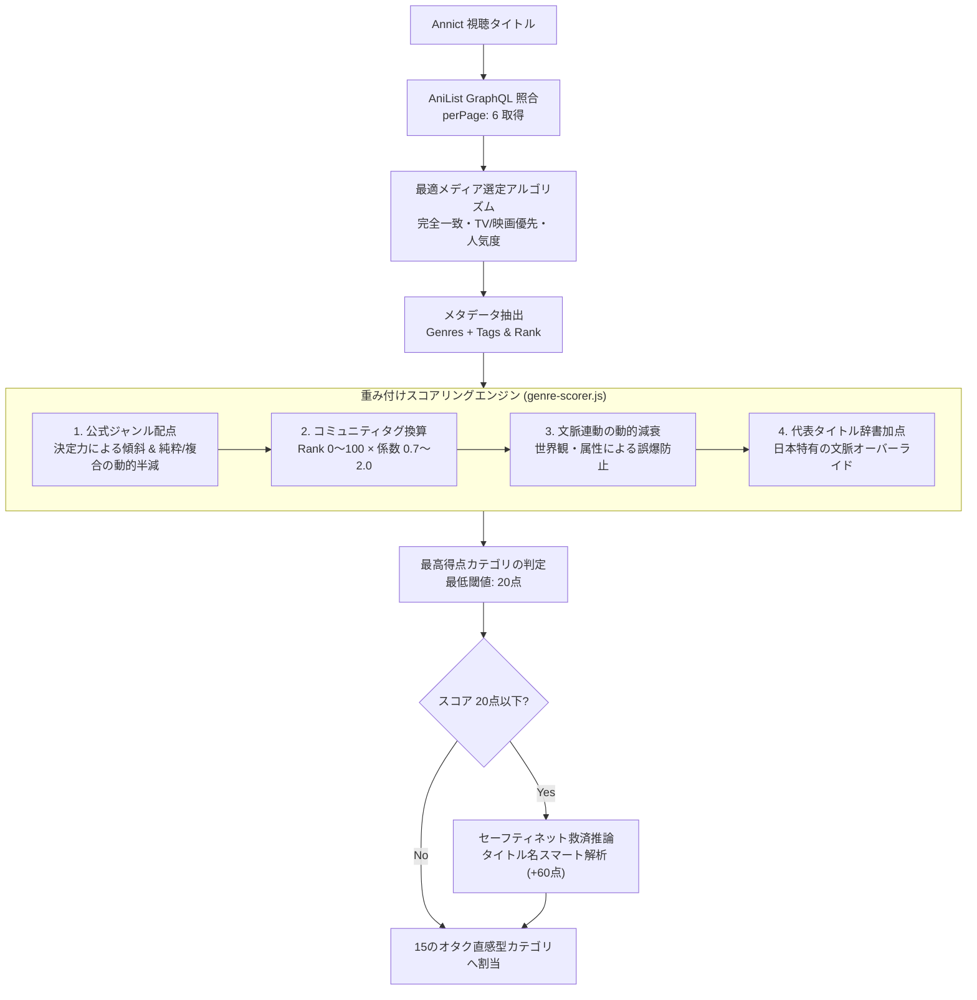

# 📚 新しいアニメジャンル分類・スコアリング方式 完全技術解説

## 1. はじめに：なぜ新方式が必要だったのか？

Annict Watched Analyzerでは、ユーザーの視聴作品から「どんなジャンルを好んでいるか」「どの分野のオタクか」を可視化するためにジャンル分析を行っています。
データソースとして世界最大級のアニメデータベースである **AniList** のメタデータを採用していますが、従来の単純な分類方法では**「アニメファンの実際の肌感覚」と大きく乖離してしまう問題**が発生していました。

本プロジェクトで刷新された「新しいジャンル分類・スコアリング方式」は、海外データベースの客観的データと、日本のアニメファン（オタク文化）の直感を高精度に融合させた**重み付けスコアリング型ハイブリッド分類システム**です。

---

## 2. 従来方式（旧方式）の限界と3大課題

従来の方式では、AniListが公式に定義している大枠のジャンル（Action, Comedy, Fantasy, Drama など）をそのまま集計していました。しかし、これには以下の深刻な欠陥がありました。

### ① 大ジャンルへの集中（ブラックホール化問題）
* AniListの「Comedy」「Action」「Fantasy」「Slice of Life」は定義が広大すぎるため、登録作品の**70〜80%以上がこれら3〜4ジャンルに吸い込まれてしまう現象**が起きていました。
* 少しでもギャグシーンがあれば「Comedy」、戦闘シーンがあれば「Action」が付与されるため、どのユーザーのグラフを見ても「コメディ1位、アクション2位」という没個性な結果になっていました。

### ② 近年の巨大トレンド・サブジャンルの埋没
* 近年のアニメ界で一大勢力を誇る**「異世界 / 転生」「悪役令嬢」**が単なる「Fantasy」や「Adventure」に埋もれて区別できない。
* **「日常系（きらら系など）」「アイドル・音楽もの」「ロボット / メカ」「魔法少女」**といった、アニメファンにとって極めて重要な文脈が独立して評価されない。

### ③ 国内アニメ文化と海外タグのニュアンスのズレ
* 例えば、日本のアニメファンにとっての「日常系（空気系・ほのぼの）」と海外の「Slice of Life」の認識にはズレがあり、シリアスな青春劇や仕事モノまで一括りにされていました。

---

## 3. システムアーキテクチャの全貌

新方式では、単純な条件分岐ではなく、**「多層加点・重み付けスコアリングエンジン（`genre-scorer.js`）」** を採用しています。

---

## 4. データ取得層：最適メディア選定アルゴリズム（Best Match Selector）

AniListからメタデータを取得する際、検索キーワードに対して単純に先頭の1件を採用すると、短編WebアニメやOVA、特番（SPECIAL）に誤爆する問題がありました。これを防ぐため、**6件の候補から最も適切な本編を選択するアルゴリズム**を導入しています。

### 判定基準とスコアリング
1. **タイトル完全一致（最優先: +1,000点）**:
   * 日本語（native）、ローマ字（romaji）、英語（english）、別名（synonyms）を正規化比較。
   * ※感嘆符 `!` や期数（`II`, `2期`）は厳密に保持し、1期と2期の取り違えを防止。
2. **フォーマット優先度（本編優先）**:
   * `TV` / `MOVIE`: **+100点**（同格の本編）
   * `TV_SHORT`: **+70点**
   * `OVA`: **+40点** / `ONA`: **+30点** / `SPECIAL`: **+10点** / `MUSIC`（MV）: **+0点**
3. **人気度・視聴者数（Popularity）ボーナス**:
   * $\min(100, \log_{10}(\text{popularity} + 1) \times 20)$
   * 視聴者が桁違いに多い本編を優先（例: 本編 20,000人 vs おまけ短編 2,000人）。

> **具体例（『22/7』のケース）**:
> * 検索1位: 短編Webアニメ『あの日の彼女たち』（ONA, 視聴者 2,598人）
> * 検索3位: 本編TV『22/7 （ナナブンノニジュウニ）』（TV, 視聴者 20,058人）
> 本アルゴリズムにより、本編TVアニメが確実に選出され、正しいジャンル・タグが取得されます。

---

## 5. 公式ジャンル（Genres）の重み付けと配点ロジック

AniListの公式ジャンルは、すべて一律の点数ではなく、**「そのジャンルが付いているだけで作品のメインテーマが確定するか（特異度・決定力）」** に応じて大きく傾斜をつけています。

### 公式ジャンルの基礎点数表
| 公式ジャンル | 基礎点数 | 特徴・設計意図 |
| :--- | :---: | :--- |
| **Mahou Shoujo** | **+200点** | 付与されている時点で魔法少女・バトルヒロインが確定する最強ジャンル。 |
| **Sports** | **+180点** | 競技・スポーツが作品の中心主題であることが確定。 |
| **Mecha** | **+160点** | ロボット・メカが主軸。アクション等への吸い込みを防止。 |
| **Romance** | **+130点** | 恋愛・人間関係が主軸。 |
| **Horror / Mystery** | **+120〜130点** | サスペンス・ホラーの空気感が作品を支配。 |
| **Music** | **+60 / 120点** | 純粋な音楽ものなら120点、アクション等複合なら60点。 |
| **Action** | **+90点** | 汎用大ジャンル。単独では決定打にならず、特化ジャンルに譲る。 |
| **Slice of Life** | **+40 / 80点** | 純粋日常なら80点、複合なら40点（半減）。 |
| **Fantasy / Sci-Fi** | **+75〜90点** | 異世界やメカ、日常等と組み合わされる世界観ベースジャンル。 |
| **Comedy** | **+35 / 70点** | 純粋ギャグなら70点、ラブコメやバトルの付随なら35点（半減）。 |

### 「純粋か（Pure）」「複合か（Mixed）」の動的半減ロジック
汎用ジャンル（Comedy, Slice of Life, Drama）が他の特化ジャンルを侵食しないよう、併記されているジャンルに応じて動的に減衰します。

* **Comedy（コメディ）**:
  * 恋愛もバトルも日常もない純粋ギャグ: **+70点**
  * ラブコメやバトルアニメの付随ギャグ: **+35点（半減）**
* **Slice of Life（日常）**:
  * アクションも恋愛もない純粋日常: **+80点**
  * バトルや恋愛がおまけで日常を持つ複合作: **+40点（半減）**
* **Drama（ドラマ・青春）**:
  * 恋愛を含まない純粋ドラマ: **+120点**
  * 恋愛を含むドラマ: **+60点**
  * **SF・ファンタジー・メカ・異世界作品の場合**: **×0.45倍 に減衰**
    （架空世界観が主体の作品では、人間ドラマがあっても世界観ジャンルが主軸と判定）

---

## 6. コミュニティタグ（Tags）とポイント換算の数式・係数表

AniListのタグは、ユーザー投票によって付与された **Rank（0〜100%の適合度スコア）** を持ちます。
新エンジンでは、各タグのRankに **「ジャンル決定力に応じた係数（0.7〜2.0倍）」** を掛けてポイントを算出します。

$$\text{獲得ポイント} = \text{タグのRank（0〜100）} \times \text{タグ固有の係数（0.7〜2.0）}$$

### タグ係数（倍率）一覧
| 区分 | 係数 | 対象タグ（代表例） | 計算例（Rank 90の場合） |
| :--- | :---: | :--- | :--- |
| **超強力タグ （主題決定）** | **×1.8 〜 ×2.0** | `Isekai` (×2.0), `Magical Girl` (×2.0) `Idol` (×1.8), `Reverse Isekai` (×1.8) `Majokko` (×1.8) | $90 \times 2.0 = \mathbf{180点}$ $100 \times 1.8 = \mathbf{180点}$ |
| **主力タグ （ジャンル中核）** | **×1.3 〜 ×1.6** | `Real Robot` (×1.6), `Band` (×1.6) `Villainess` (×1.6), `Athletics` (×1.4) `Romantic Comedy` (×1.3), `Coming of Age` (×1.3) `Detective` (×1.3), `Disability` (×1.3) | $90 \times 1.6 = \mathbf{144点}$ $90 \times 1.3 = \mathbf{117点}$ |
| **標準タグ （補強要素）** | **×0.9 〜 ×1.2** | `CGDCT（美少女日常）` (×1.2), `Outdoor` (×1.1) `Slapstick` (×1.2), `Super Power` (×1.1) `Guns` (×1.1), `Cyberpunk` (×1.2) `Female Harem` (×1.0), `Magic` (×0.9) | $80 \times 1.2 = \mathbf{96点}$ $80 \times 1.0 = \mathbf{80点}$ |
| **補助・スパイス要素** | **×0.7 〜 ×0.8** | `Tsundere` (×0.7), `Fanservice` (×0.8) `School Club` (×0.8), `Cohabitation` (×0.8) `Urban Fantasy` (×0.8) | $80 \times 0.7 = \mathbf{56点}$ |

---

## 7. 文脈に応じた動的減衰（誤爆防止フィルター）

特定の要素は、作品の世界観によって意味合いが大きく変化します。これを機械的に判定すると誤爆するため、**文脈条件に応じた減衰フィルター**を搭載しています。

### ① `Iyashikei`（癒やし系タグ）の減衰
* 通常の日常アニメ（『ゆるキャン△』『のんのんびより』等）: **×1.2倍**
* ハイファンタジー・バトル（『葬送のフリーレン』等）: **×0.3倍 に減衰**
  > （ファンタジーの旅の叙情的な雰囲気に癒やしタグが付いていても、日常系に吸い込まれないように保護）

### ② `Military` / `War`（軍事・戦争タグ）の減衰
* 通常の戦記アニメ（『ガルパン』『キングダム』等）: **×1.1倍**
* 魔法・超能力・SFがメイン（『進撃の巨人』『Dr.STONE』等）: **×0.3倍 に減衰**
  > （軍隊組織が登場するバトル作品がミリタリー枠に吸い込まれるのを防止）

### ③ 『ダンまち』の異世界除外フィルター
* 『ダンジョンに出会いを求めるのは間違っているだろうか』は、ライトノベル原作でノリが近いため海外タグで異世界扱いされがちですが、生粋の神話ハイファンタジーであるため、**`isekai` スコアを強制的に 0点 にリセット**。

---

## 8. 代表タイトル辞書（Regex）とセーフティネット救済

### 代表タイトル辞書加点（+140〜180点）
海外データベースでタグ付けが不十分な作品や、日本特有のニュアンスを持つ代表作（約300タイトル以上）を正規表現辞書で補正します。
* 例: プリキュア、まどマギ（魔法少女 +180点）
* 例: ガンダム、エヴァ、ギアス（メカ +150点）
* 例: ゆるキャン、ごちうさ、きんモザ（日常 +140点）
* 例: よりもい、SHIROBAKO、ユーフォ（ドラマ +150点）

### セーフティネット救済（フォールバック）
AniListに未照合の作品や海外タグが一切ない新規作品でも、全カテゴリのスコアが20点以下（未判定）になった場合、タイトル文字列からキーワード推論を行い、**スマート救済スコア（+60点）** を付与して「その他」への過度な埋没を防ぎます。

---

## 9. 15の独立オタク直感型カテゴリ一覧

| ID | カテゴリ名 | アイコン / 色 | 該当する代表作品 |
| :--- | :--- | :---: | :--- |
| `isekai` | **異世界 / 転生** | 🚪 `#8b5cf6` | 無職転生、リゼロ、このすば、オーバーロード、陰の実力者 |
| `mahou_shoujo` | **魔法少女 / バトルヒロイン** | 🪄 `#fb7185` | まどマギ、プリキュア、なのは、シンフォギア、結城友奈 |
| `mecha` | **ロボット / メカ** | 🤖 `#6b7280` | ガンダム、エヴァ、コードギアス、マクロス、グリッドマン |
| `sports` | **スポーツ / 競技** | ⚽ `#14b8a6` | ハイキュー!!、ブルーロック、黒子のバスケ、ウマ娘、頭文字D |
| `history_military` | **歴史 / 戦記 / ミリタリー** | 🛡️ `#64748b` | ガルパン、幼女戦記、キングダム、ヴィンランド・サガ、銀河英雄伝説 |
| `idol_music` | **アイドル / 音楽** | 🎵 `#eab308` | 22/7、ラブライブ！、アイマス、ぼっち・ざ・ろっく！、ガルクラ |
| `comedy` | **コメディ / ギャグ** | 😆 `#f59e0b` | 銀魂、あそびあそばせ、日常、ポプテピピック、斉木楠雄 |
| `nichijou` | **日常 / ほのぼの** | ☕ `#10b981` | ゆるキャン△、ごちうさ、のんのんびより、きんモザ、メイドラゴン |
| `sf_fantasy` | **SF / ファンタジー** | ☄️ `#6366f1` | フリーレン、シュタゲ、ダンジョン飯、SAO、メイドインアビス |
| `horror_suspense` | **ホラー / サスペンス / 推理** | 💀 `#475569` | ひぐらし、未来日記、うみねこ、PSYCHO-PASS、薬屋のひとりごと |
| `ecchi` | **エッチ / お色気** | 🔥 `#f43f5e` | To LOVEる、ハイスクールD×D、ヨスガノソラ、異種族レビュアーズ |
| `action` | **アクション / バトル** | 💥 `#ef4444` | 鬼滅の刃、呪術廻戦、チェンソーマン、進撃の巨人、ヒロアカ |
| `romance` | **恋愛 / ラブコメ** | 💖 `#ec4899` | かぐや様、五等分の花嫁、僕ヤバ、着せ恋、とらドラ！、俺ガイル |
| `drama` | **ドラマ / 青春** | 🎭 `#0284c7` | よりもい、SHIROBAKO、響け！ユーフォニアム、ヴァイオレット、聲の形 |
| `other` | **その他** | ⋯ `#9ca3af` | ショートアニメ、特殊PV、子供向け・教養作品など |

---

## 10. 実測シミュレーション例

新エンジンの計算ロジックによって、作品がどのように評価されるかの具体例です。

### 事例1：『22/7』
* **公式ジャンル**: Drama (+60), Music (**+120**)
* **タグ**: Idol (Rank 100 × 1.8 = **+180**), Cute Girls Doing Cute Things (Rank 86 × 1.2 = +103)
* **合計スコア**: **アイドル / 音楽: 300点** vs 日常: 103点 vs ドラマ: 60点
* **判定結果**: **アイドル / 音楽（idol_music）**

### 事例2：『かぐや様は告らせたい』
* **公式ジャンル**: Romance (**+130**), Psychological (+80), Comedy (+35 ※複合のため半減)
* **タグ**: Romantic Comedy (Rank 96 × 1.3 = **+125**)
* **タイトル加点**: 代表ラブコメタイトル (**+150**)
* **合計スコア**: **恋愛 / ラブコメ: 405点** vs コメディ: 35点
* **判定結果**: **恋愛 / ラブコメ（romance）**（コメディへの吸い込みを完全防止）

### 事例3：『機動戦士ガンダム 水星の魔女』
* **公式ジャンル**: Mecha (**+160**), Action (+90), Sci-Fi (+90)
* **タグ**: Real Robot (Rank 95 × 1.6 = **+152**)
* **タイトル加点**: ガンダム代表作 (**+150**)
* **合計スコア**: **ロボット / メカ: 462点** vs アクション: 90点 vs SF: 90点
* **判定結果**: **ロボット / メカ（mecha）**（アクションへの吸い込みを完全防止）

---

## 11. まとめ

新しいジャンル分類・スコアリング方式は、
1. **AniList候補からの高精度な本編メディア選定（Best Match Selector）**
2. **公式ジャンルの特異度傾斜と複合半減ロジック**
3. **約1,000種のコミュニティタグのRank×係数ポイント換算**
4. **文脈連動の動的減衰と日本文化に即したタイトル補正辞書**

これらを統合することで、ブラックホール化を根絶し、**「アニメファンの直感に極めて忠実なオタク属性の可視化」** を実現しています。
